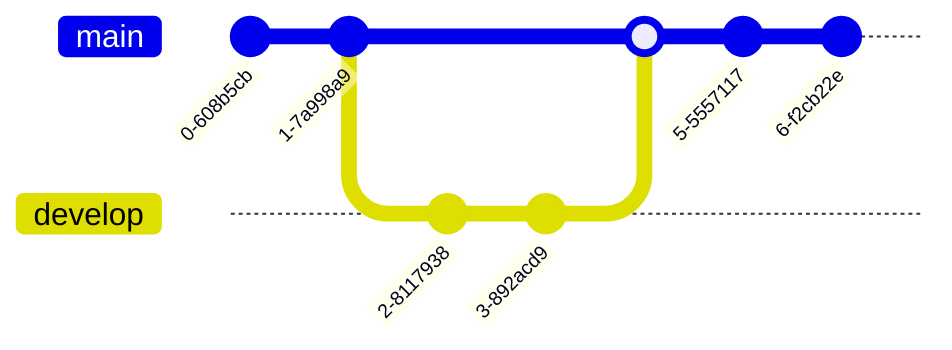

# Guía de contribución

## Envío

### workflow
<!-- TODO: Especificar workflow -->



### branchs

<!-- TODO: Especificar politicas -->
Un solo developer

```bash
git checkout -b developer/feature
```

Multi developer

```bash
git checkout -b feature/integration
```

```bash
git checkout -b developer/feature
```

## Commits

### Formato del mensaje

Para poder crear changelogs, se seguirá las recomendaciones de [conventional commits](https://www.conventionalcommits.org/en/v1.0.0/#summary)

Cada commit consistirá en un `header` , `body` (opcional) y `footer` (opcional)

```txt
<header>

<body>

<footer>
```

### Header

No debe pasar de los 50 caracteres

```txt
<type>: <resumen>
  │       │             
  │       │   
  │       │
  │       └─⫸Resumen en tiempo presente y transitivo. Sin mayúsculas ni punto final.
  │
  └─⫸ Commit Type: [
  'build',
  'chore',
  'ci',
  'docs',
  'feat',
  'fix',
  'perf',
  'refactor',
  'revert',
  'style',
  'test'
]
```

#### Ejemplo header

```txt
feat: Agrega pasarela de pagos con codigo qr
```

#### Tipos de commit

<!-- TODO: add commit types explanation -->

Más [información](https://github.com/conventional-changelog/commitlint/tree/master/%40commitlint/config-conventional) del type

### Body

No debe exceder los 70 caracteres (opcional, preferir multi linea en caso se exceda).

#### Ejemplo body

```txt
Generación de código QR con la lib XYZ integrando Niubbiz.
```

Explicar el por qué del cambio.

### Footer

Colocar en caso sean BREAKING CHANGE o DEPRECATION

#### Ejemplo footer

```txt
BREAKING CHANGE: Se actualiza el script del iframe de Niubiz para comptabilidad con el lector QR
```

<!-- TODO: Add image example of complete commit -->

```bash
git commit -am "nsvdvsddsv "
```
